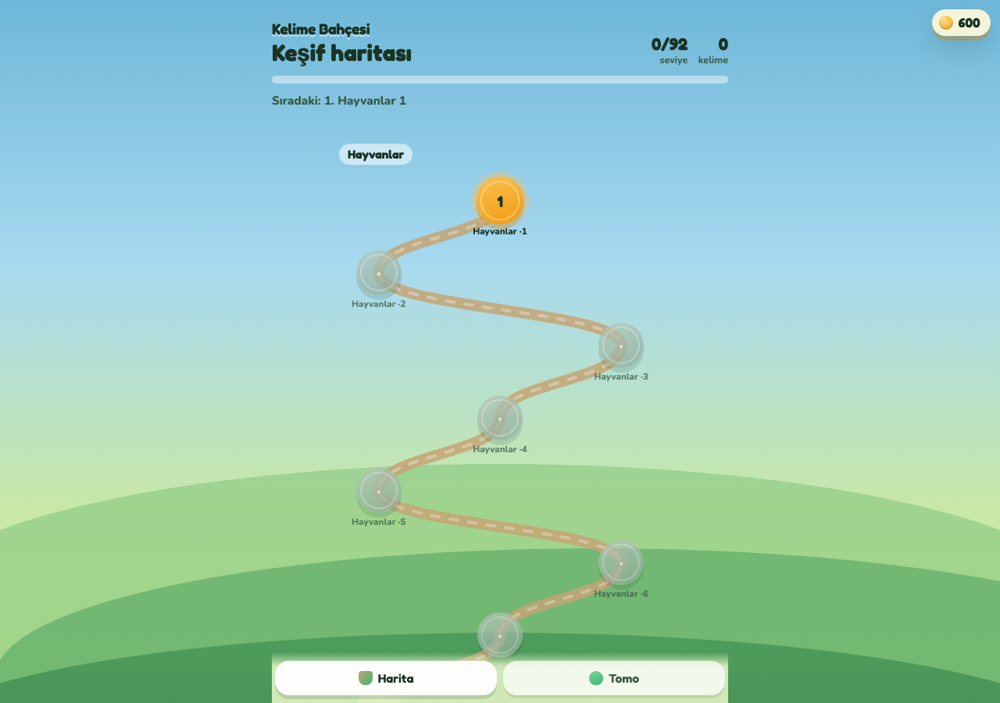
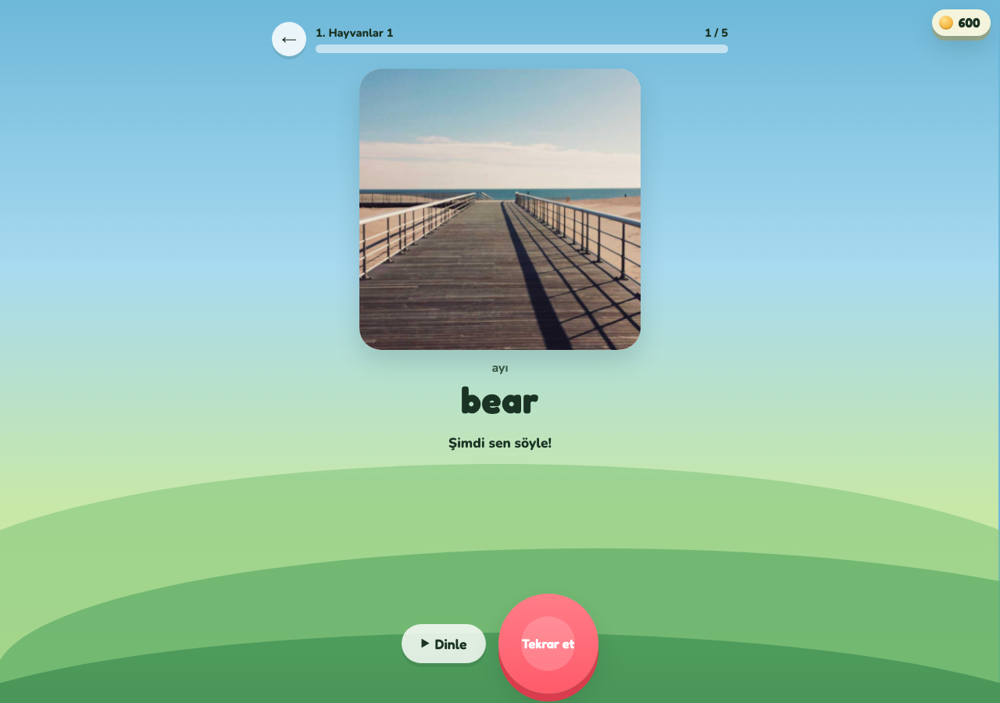
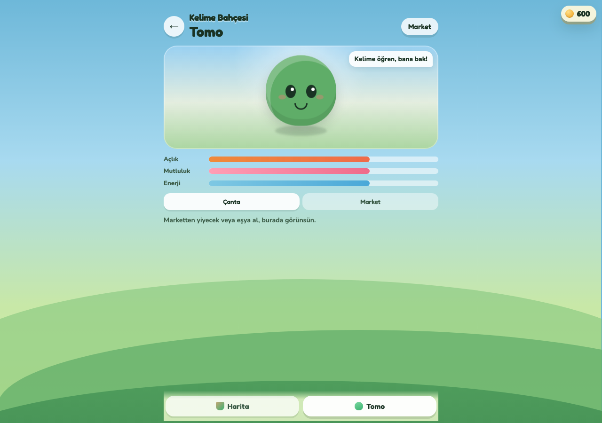
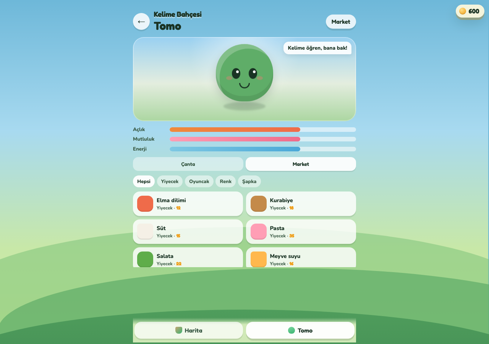

# Kelime Bahçesi

Dinle, bak, söyle. Doğru kelimede bahçe parası birikir. Parayla Tomo’ya yiyecek, oyuncak, renk ve şapka alınır.

Listen, look, say it. A correct word earns garden money. That money buys Tomo food, toys, colors, and hats.










## Kurulum / Setup

```bash
cd kids-english-words
node server/gateway.mjs
```

Aç / Open: http://127.0.0.1:5174

`PORT` portu değiştirir. `npm start` aynı kapıyı açar.

`PORT` changes the port. `npm start` opens the same door.

İlk açılışta kelime listesi disk önbelleğinden gelir. Önbellek yoksa servis listeyi ağdan kurmayı dener; olmazsa gömülü yedek seviyeler kullanılır.

On first launch the word list comes from the disk cache. If the cache is missing, the service tries to build the list from the network, then falls back to the levels bundled in the code.

## Teknoloji / Stack

Tek **Node** süreci üç işi bir kapıdan verir. / One **Node** process serves three jobs from one port.

| Yol / Path | İş / Job |
| --- | --- |
| `GET /api/levels` | Cambridge YLE seviyeleri. Disk önbelleği `cache/levels.json`. / Cambridge YLE levels. Disk cache `cache/levels.json`. |
| `GET /api/media?word=cat` | Kelime görseli ve Türkçe karşılık. Görsel Wikipedia’dan. / Word image and Turkish gloss. The image comes from Wikipedia. |
| `GET /api/shop` | Market kataloğu ve ödül sabitleri. / Shop catalog and reward constants. |
| `GET /api/health` | Kapı ayakta mı. / Whether the gateway is up. |

İstemci `public/` altında çerçevesiz ES modülleri: `api.js`, `state.js`, `speech.js`, `screens/`. Konuşma tanıma tarayıcının Web Speech API’si ile çalışır; Chrome veya Edge daha sorunsuzdur. İlerleme bu tarayıcının kendi kaydında durur.

The client is framework-free ES modules in `public/`: `api.js`, `state.js`, `speech.js`, `screens/`. Speech recognition uses the browser Web Speech API; Chrome or Edge is the smoother path. Progress stays in that browser.

## iOS

Aynı akışın SwiftUI kopyası `KelimeBahcesi-iOS/` içindedir. / The same flow has a SwiftUI copy in `KelimeBahcesi-iOS/`.

```bash
open KelimeBahcesi-iOS/KelimeBahcesi.xcodeproj
```
