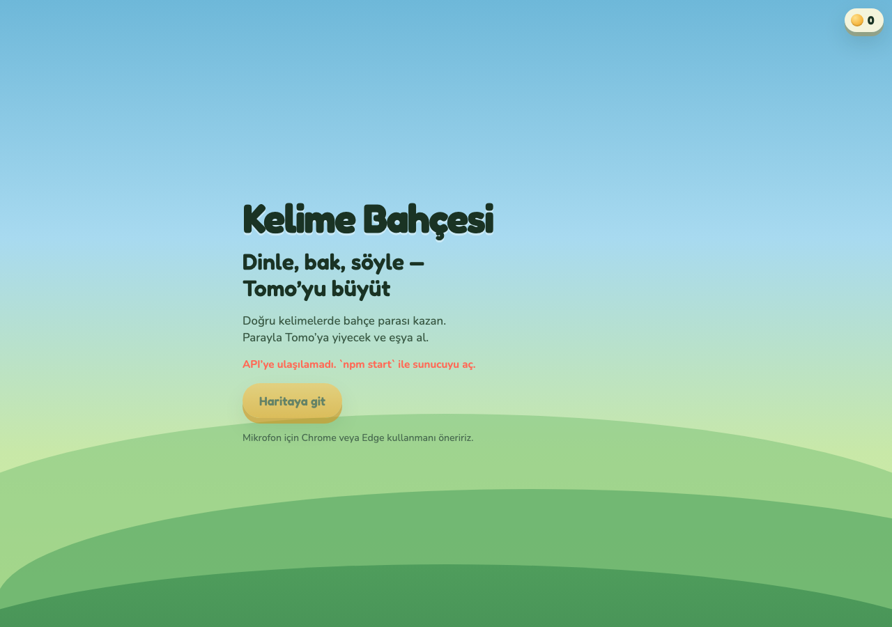

# Kelime Bahçesi v2




Mikroservis mimarisi: gateway + words / media / shop.

## Çalıştırma

```bash
cd kids-english-words
npm start
```

Aç: [http://localhost:5174](http://localhost:5174)

## Servisler

| Endpoint | Servis | Görev |
|----------|--------|--------|
| `GET /api/levels` | words | Cambridge YLE seviyeleri (disk önbellek) |
| `GET /api/media?word=cat` | media | Wikipedia görseli + TR |
| `GET /api/shop` | shop | Market kataloğu + ödül sabitleri |
| `GET /api/health` | gateway | Sağlık kontrolü |

İstemci ince ES modülleri: `public/js/` (api, state, speech, screens).

## iOS (Swift)

Aynı özellikler SwiftUI ile: [`KelimeBahcesi-iOS/`](KelimeBahcesi-iOS/README.md)

```bash
open KelimeBahcesi-iOS/KelimeBahcesi.xcodeproj
```
